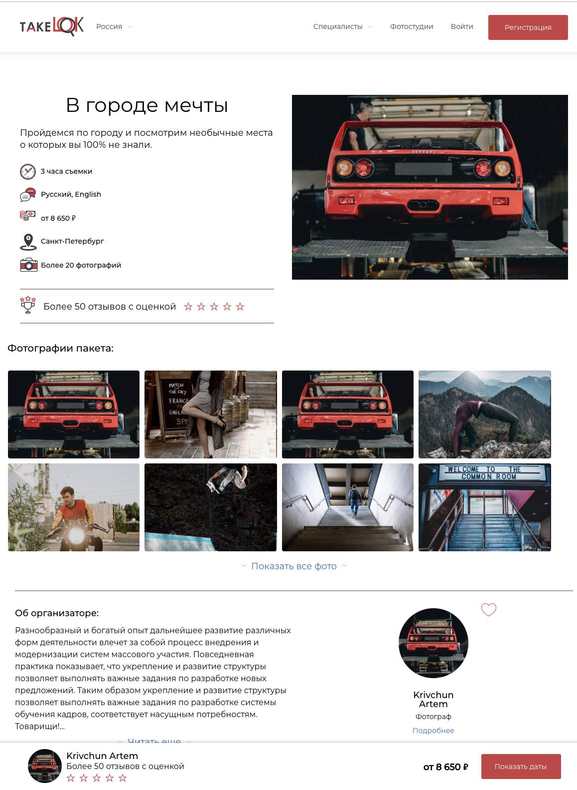

**Тестовое задания на позицию Frontend разработчика**

В зависмости от вашего уровня мы предлагаем выполнить часть обязательных и не обязательных задач. 

1. Сделать верстку исключительно главной страницы [макета](https://www.figma.com/file/fUkK2PvQPPldpqpcq6Hx0pgm/Untitled?node-id=0%3A1)
2. Заполнить макет доступными [данными](./api.json) (коллекция postman)  
_Данные в дизайне отличаются от данных в запросе (в конце описания мы покажем пример страницы)_

**Необязательные задачи**
- Адаптивная верстка
- Использование линтера/форматера
- Ленивая подгрузка компонентов или модулей
- Создать изоморфное приложение 
- Использование Mock-объектов

**Ссылки которые помогут решить задачу**

https://learnnextjs.com/

https://github.com/unicodeveloper/awesome-nextjs

https://reactjs.org/

https://ant.design/

https://redux.js.org/

https://github.com/mbeaudru/modern-js-cheatsheet

http://www.react.express/

https://eslint.org/docs/user-guide/getting-started

https://www.getpostman.com/downloads/

https://www.apollographql.com/docs/react/

**Результат работы**
Результатом работы должна быть ссылка на ваш личный репозиторий. 
Идеальным вариантом станет еще ссылка на работающее [приложение](https://www.heroku.com/)
Мы ценим ваше время и готовы рассматривать работы с не полной версткой макета, например без блока комментарии и рекомендации.

---
Удачи, если будут какие-то вопросы, то пишите, kirill@devjs.ru

Либо telegram https://t.me/kirillborovkov

